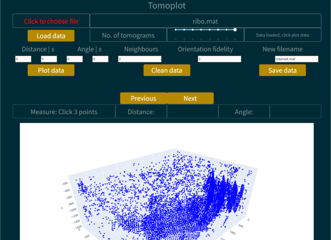

# Tomoplot

Tomoplot is an application for use in conjunction with emClarity [found here](https://github.com/StochasticAnalytics/emClarity) to remove bad picks of proteins which form a regular lattice (see below). [Try it out here](https://live-tomoplot.onrender.com/), you can't upload or save data but you can use the test data, the data cleaning runs a bit slowly so be patient or download repo and run locally for best performance.

## Usage

To run tomoplot clone the github repository, ensure that the dependencies have been installed and then open a terminal and type:

python tomoplot.py

This will open the tomoplot app in your default browser. You can then choose the file you want to use. This should be a .mat file produced by emClarity containing the information about the subtomogram picks made by the software.

You can then use the slider to choose how many tomograms you want to load and then click Load data. Once the data is loaded click Plot data to visualise the positions of your subtomograms. Use the Next and Previous buttons to iterate through the different tomograms you have loaded.

## Setting cleaning parameters

There are several parameters you can use to define the conditions for picking your proteins complexes out of the lattice. You can enter the distance between the pick and its nearest neighbours and give an error value for this distance.
You can also choose the angle between the pick and its nearest neighbours and also give an error value.
You can select the number of nearest neighbours to consider when calculating these values, 5-7 works best.
The last parameter is called orientation fidelity, this parameter selects based on how closely aligned the orientations of the nearest neighbours are with the pick. The highest value you can choose is the square of the number of nearest neighbours you select.
To run the cleaning click Clean data. If you are unhappy with the parameters you select simply change them and click Clean data again.

## Measuring parameters

If you are unsure what values are suitable for your lattice you can find good values from the graph. Click on a point and then click on two more points to get the average distance to those points and the angles between them, then use these values distance and angle with suitable error terms.

## Saving data

Once you are happy with the cleaning type the name you want for your cleaned data and click Save data, this will save your cleaned data which can be used for further processing with emClarity.
